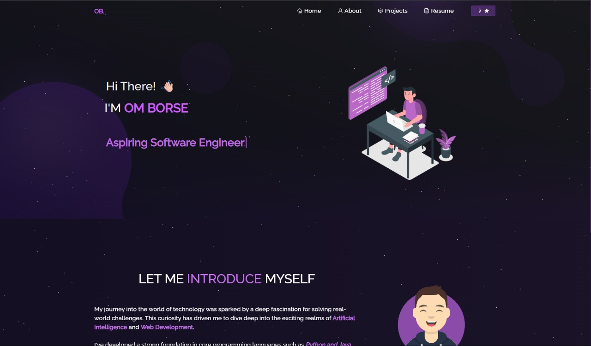

# Om Borse's Personal Portfolio



This is my personal portfolio, built with React.js. It's a customized version of a template, redesigned to reflect my personal brand, skills, and projects.

## 🚀 Live Demo

[View the live portfolio here!](https://portfolio-g025mpzdz-om-borse26s-projects.vercel.app/)

---

## ✨ Features

- **Fully Personalized:** Replaced all placeholder content with my personal information, projects, and resume.
- **Modern UI:** Redesigned with a fresh, modern blue color scheme.
- **Dynamic Animations:** Includes smooth fade-in animations for a professional feel.
- **Responsive Design:** Looks great on all devices, from mobile to desktop.
- **Live Resume:** Features an integrated PDF viewer for my resume.
- **Showcases My Projects:** Highlights my best work with descriptions and links to the code.

---

## 🛠️ Technologies Used

- **React.js:** For building the user interface.
- **React Router:** For navigation within the portfolio.
- **React Bootstrap:** For layout and UI components.
- **React Awesome Reveal:** For animations.
- **CSS3 & HTML5:** For styling and structure.
- **Vercel:** For hosting and deployment.

---

## 🔧 Setup and Installation

To run this project locally, follow these steps:

1. **Clone the repository:**
   ```sh
   git clone https://github.com/Om-Borse26/Portfolio.git
   ```
2. **Navigate to the project directory:**
   ```sh
   cd Portfolio
   ```
3. **Install the dependencies:**
   ```sh
   npm install
   ```
4. **Start the development server:**
   ```sh
   npm start
   ```

The portfolio will then be available at `http://localhost:3000`.

---

## 📄 License

This project is licensed under the MIT License. See the [LICENSE](LICENSE) file for details.

---

## 📫 Contact

- **GitHub:** [@Om-Borse26](https://github.com/Om-Borse26)
- **LinkedIn:** [Om Borse](https://www.linkedin.com/in/om-borse-592a0225b) 